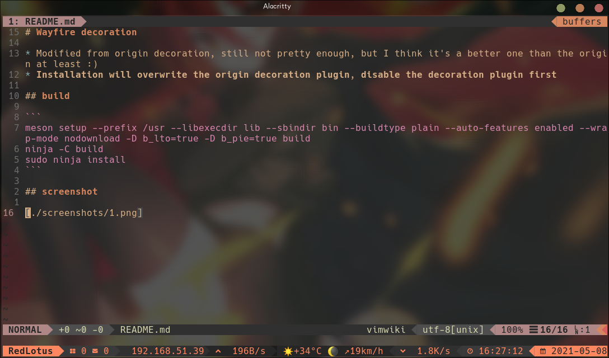

# Wayfire decoration

* Modified from origin decoration, still not pretty enough, but I think it's a better one than the origin at least :)
* **Installation will overwrite the origin decoration plugin, disable the decoration plugin first**

## build

```
meson setup --prefix /usr --libexecdir lib --sbindir bin --buildtype plain --auto-features enabled --wrap-mode nodownload -D b_lto=true -D b_pie=true build
ninja -C build
sudo ninja install
```

## screenshot


